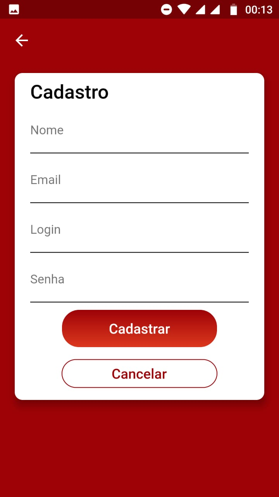
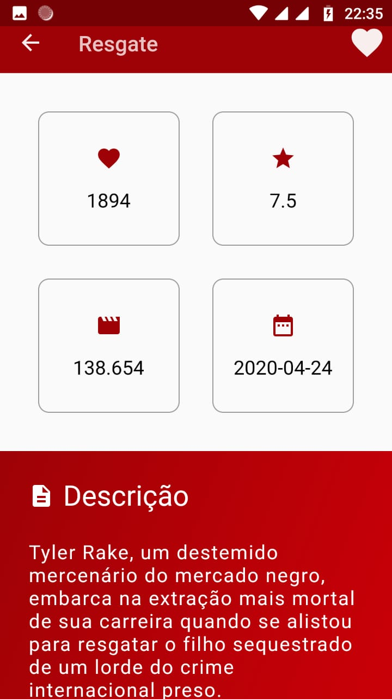

# App-Filmes-Flutter

Simples app de lista de filmes com base no exemplo do curso de Flutter Essencial utilizando Bloc Pattern.

https://www.udemy.com/flutter-essencial/

## Telas

          

## App

